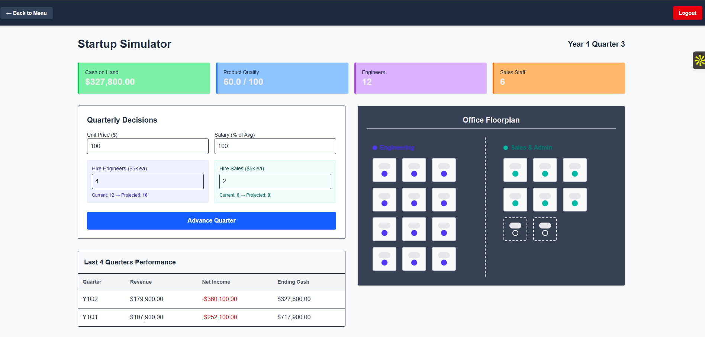
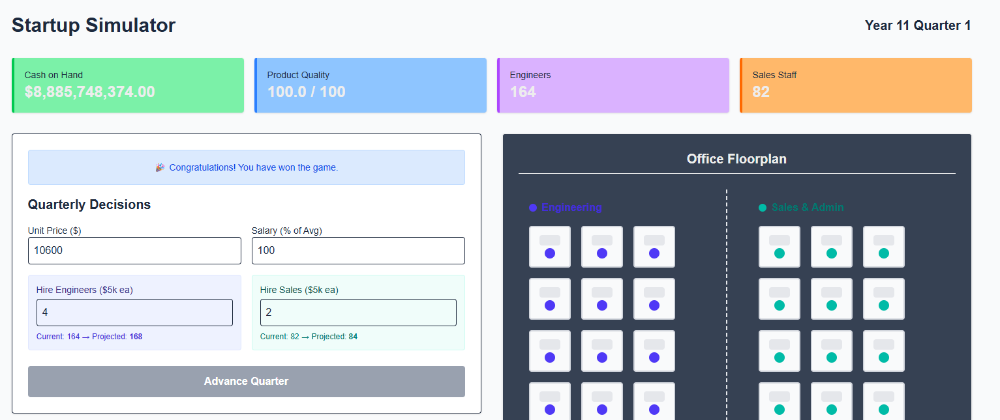
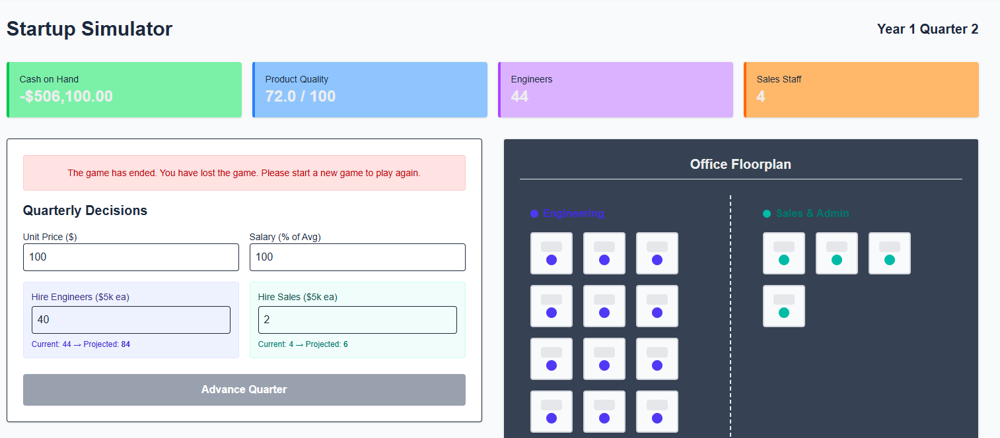

# Startup Simulator

A single-player, turn-based startup simulation game where players manage a growing software company. The game requires balancing quarterly business decisions (pricing, salaries, and hiring) against a server-authoritative mathematical model to avoid bankruptcy and reach a 10-year win state.

Built with **Next.js** (App Router) and **Supabase** (PostgreSQL, Auth, RLS)


## Setup Instructions

Ensure you have Docker (for local Supabase) and Node.js installed. 

```bash
# 1. Install dependencies
npm install

# 2. Copy environment variables and fill in your Supabase credentials
cp .env.example .env.local

# 3. Push the database schema to your Supabase project
npx supabase db push

# 4. Start the development server
npm run dev
```

## Write-up

**Problem Solved:** This project delivers a server-authoritative, turn-based startup simulation. It provides a cohesive vertical slice where players manage quarterly business decisions (pricing, hiring, salaries) while a secure backend mathematical model computes economic outcomes and visualizes organizational growth.

**Technical Decision:** I combined Next.js App Router with Supabase PostgreSQL RPCs (Remote Procedure Calls). By isolating the game engine into pure server-side modules and executing both the current state updates and the history logging within a single atomic database transaction, I guaranteed clients cannot manipulate simulation outcomes. This zero-trust architecture prevents race conditions and enforces strict data integrity.

**Future Improvement:** Given the opportunity, I would implement Supabase Realtime subscriptions on the frontend. Currently, the client relies on standard HTTP requests to fetch the newly computed state after a turn advances. Subscribing directly to database changes would allow the dashboard and office visualization  to update instantly, creating a smoother, more reactive user experience

## Architecture & Database Schema

The database is designed around three core principles: separation of concerns, data integrity, and zero-trust security.
- **The Mutable State (`games` table):** Acts as the single source of truth for an active session. It holds running totals (cash, headcount, quality) and pending decisions for the current quarter.
- **The Immutable Ledger (`turn_history` table):** An append-only log of every completed quarter. It uses cascading deletes tied to the `games` table, ensuring automatic cleanup if a user restarts their game. This feeds directly into the performance history chart.
- **Atomic Transactions:** Advancing a turn requires updating the `games` table and inserting a row into `turn_history`. By wrapping both commands inside a single PostgreSQL Remote Procedure Call (`advance_game_turn`), we created an atomic transaction. If the server crashes mid-request, the database cannot be corrupted.
- **Row Level Security (RLS):** Policies are enforced directly at the database layer. Users can only read, insert, update, or delete rows where `auth.uid() = user_id`, tying security to the data itself rather than relying solely on the application layer.

## What Was Built

**Authentication:** Fully secured email and password login using Supabase Auth, including a PKCE flow for password resets.

**Server-Authoritative** Game Loop: The core mathematical model executes purely on the server using Next.js Route Handlers and strictly validated with Zod. State is persisted via an atomic PostgreSQL function (advance_game_turn).

**Material Design Dashboard:** A clean, responsive dashboard utilizing next-themes, displaying current metrics and a ledger of the last 4 quarters.

**Dynamic Office Visualization:** A DOM-based visual representation of the startup that dynamically scales as engineering and sales headcount grows.

**Zero-Trust Security:** Row Level Security (RLS) is strictly enforced on all tables, ensuring users can only read, update, or delete their own game states.

## Tradeoffs & Descoping Decisions

**Office Visualization Rendering:** I opted to use pure React DOM elements styled with Tailwind CSS rather than reaching for the Canvas API or WebGL. This decision prioritized maintainability, instant server-side rendering, and bundle size over complex animations, which perfectly satisfied the requirement to show visually distinct desks filling up as headcount grows.

**Economic Simulation Scope:** The mathematical simulation was kept strictly to the provided constants and formulas. I intentionally avoided adding complex market dynamics (like fluctuating competitor pricing or randomized market crashes) to focus the evaluation on architectural engineering execution rather than game design.

## Screenshots

### Dashboard
<p align="center">
  
</p>

### Game Win Scenario
- Complete 10 years with positive cash
<p align="center">
   
</p>

### Game Lose Scenario
- Cash goes into negative
<p align="center">
   
</p>